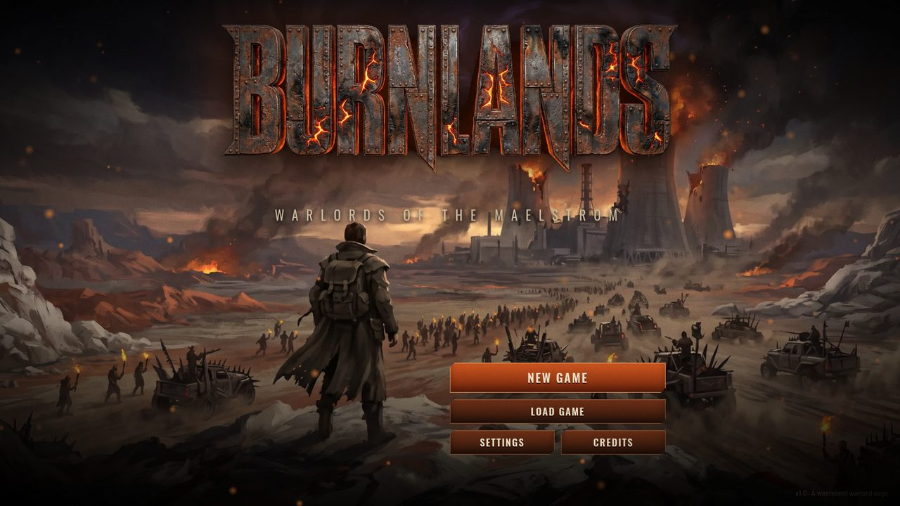
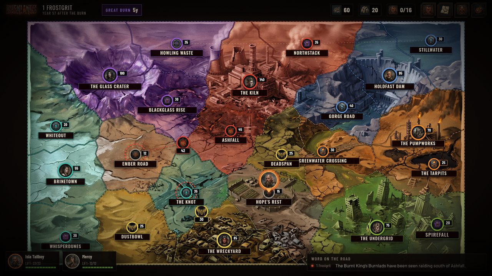
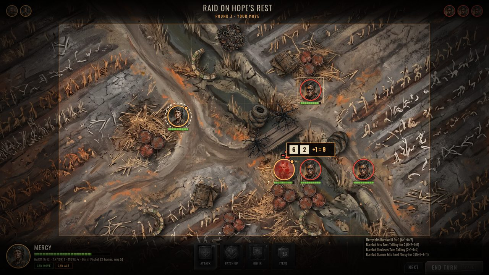
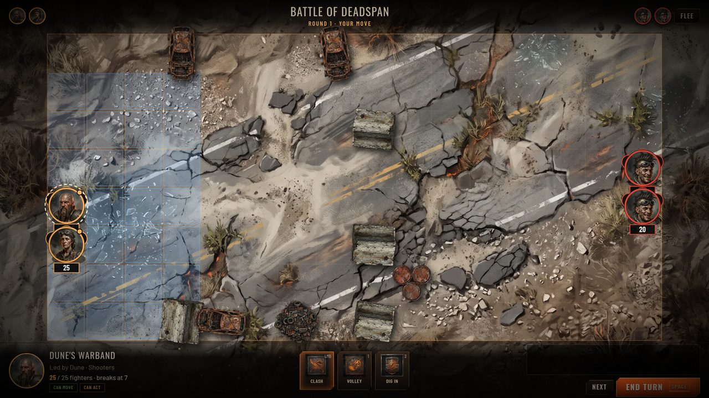
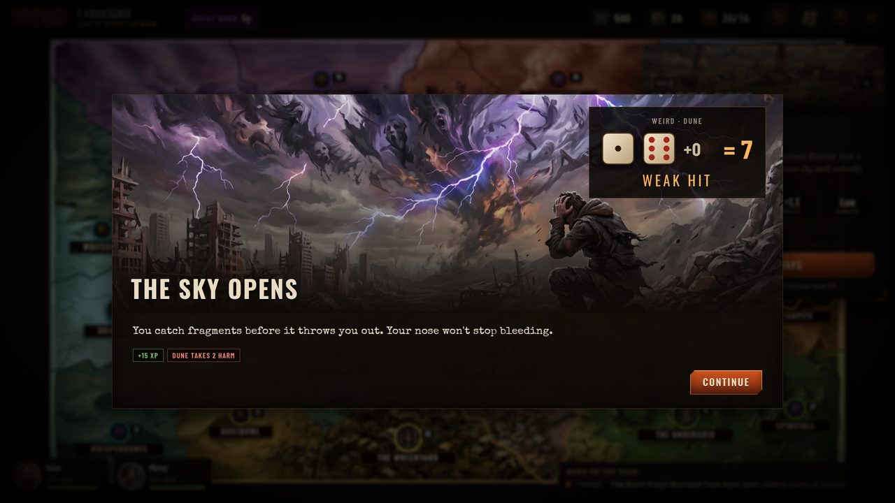
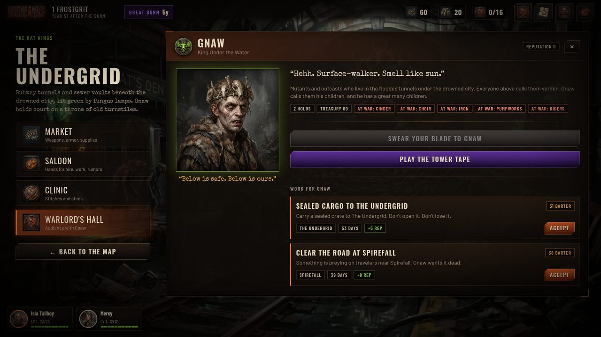
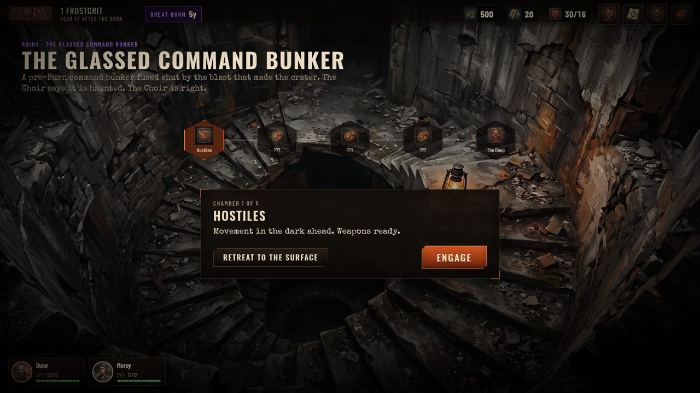

# BURNLANDS — Warlords of the Maelstrom



**BURNLANDS** is a strategic wasteland RPG for the browser. You are one drifter in a burned basin where seven warlords wage an endless war for territory — and where the Burnt King, listening to the psychic storm beneath the world, means to set everything on fire again.

The setting pays homage to **_Apocalypse World_** (playbooks, the 2d6 move, harm, barter and the psychic Maelstrom). The structure takes loose inspiration from **Koei's _Inindo: Way of the Ninja_**: a living strategic map that turns whether you act or not, a small crew of hired companions, work for warlords, ruins to plunder, and army battles when you rise high enough to command.

---

## Play

```bash
npm install
npm run dev        # http://localhost:5173
```

or build a static bundle:

```bash
npm run build      # outputs dist/ — host it anywhere (it uses relative paths)
npm run preview
```

A GitHub Actions workflow (`.github/workflows/deploy.yml`) builds and publishes the game to GitHub Pages on every push to `main`. Enable it once under **Settings → Pages → Source: GitHub Actions**.

The game is designed for a desktop browser at 16:9 (it scales to any window size). Sound on, fullscreen (F11) recommended. Progress is saved in your browser (autosave plus three manual slots).

---

## The game

| | |
|---|---|
|  |  |
| **A living world.** 23 regions, 7 warlords, independent free holds. Every month warlords collect tribute, recruit, scheme and march; armies crawl across the map in real time and holds change hands. | **Tactical skirmishes.** Turn-based grid combat on painted battlefields with cover, line of sight, burning ground, psychic powers, overwatch, suppression and downed crew who bleed out. |
|  |  |
| **Army battles.** Rise through a warlord's ranks — or seize a hold and become a warlord yourself — and your crew leads gangs of fighters in pitched battles that decide who owns the map. | **Moves & encounters.** 18 illustrated road encounters, jobs and story scenes resolved with Apocalypse-World-style 2d6 moves: 10+ strong hit, 7–9 weak hit, 6- miss. |
|  |  |
| **Seven warlords.** Earn reputation through jobs, swear your blade, climb from Sworn Hand to Warboss, broker peace, or turn them against the Burnt King with the Tower Tape. | **Ruins.** Multi-chamber delves through pre-Burn bunkers, drowned towers and buried airfields: fights, traps, caches, Maelstrom shrines and a boss at the bottom. |

### Features

- **8 playbooks** (Gunhand, Sawbones, Duelist, Mindbender, Prophet, Road Boss, Wrencher, Siren), each with three unlockable moves, a passive and an army order; 48 painted faces.
- **Five stats** — Cool, Hard, Hot, Sharp, Weird — used in combat and in every risky choice. Level up to 8 and improve your stats.
- **Crew of four**: hire companions in saloons across the basin; they level with you and can die for good.
- **Warband & warlords**: hire sellswords, pledge to a faction and earn merit, lead your warlord's host into battle, or found your own hold and rule it (monthly tribute, garrisons, marching orders).
- **Diplomacy**: faction relations drift, border incidents spark wars, truces form, and a Cinder Throne that grows too strong unites everyone against it.
- **Jobs**: bounty, delivery, sabotage, supply raids, scouting, assassination, envoy missions and ruin-plundering, all with real effects on the strategic simulation.
- **A main quest** with two routes to the Burnt King (infiltrate the Kiln with its keycard, or storm the walls with a coalition army), a ticking **Great Burn** countdown, and multiple endings.
- **3 difficulties**; permadeath for your hero on the hardest.

### Controls

| | |
|---|---|
| Map | Click a region to inspect it; drag to pan, scroll to zoom |
| Combat | Click a fighter, then a blue tile to move or a red-ringed enemy to attack. `1`–`5` abilities, `Tab` next fighter, `Space` end turn, right-click / `Esc` cancel |
| Anywhere | `C` crew & gear, `J` journal, `F` warlords, `Esc` menu |

---

## How it was made

Everything in this repository was created from scratch for this project.

- **Code**: TypeScript + [Preact](https://preactjs.com) + Vite. The strategic simulation, rules engine and AI are framework-free (`src/game`, `src/combat`); the tactical battlefield is a custom Canvas 2D renderer with particles, tracers and screen shake (`src/combat/render.ts`); the world map is SVG with Voronoi borders (`src/ui/mapgeo.ts`).
- **Art**: ~240 paintings, portraits, maps, props, sigils and icons generated with Google Gemini image models via OpenRouter from a written art bible — see [`tools/manifest.py`](tools/manifest.py). Props and sigils are chroma-keyed to transparency; everything is converted to WebP by [`tools/process_assets.py`](tools/process_assets.py).
- **Music**: a 15-track original soundtrack generated with Google Lyria 3 via OpenRouter ([`tools/generate_music.py`](tools/generate_music.py)).
- **Sound effects**: CC0 packs from [Kenney](https://kenney.nl) and CC0 firearm recordings from [OpenGameArt](https://opengameart.org), trimmed and normalized by the asset pipeline.
- **Fonts**: Oswald, Barlow, Barlow Condensed and Special Elite (SIL Open Font License).

Total generation spend (OpenRouter): about **$21**; see `tools/spend.log`.

### Project layout

```
src/
  data/        factions, regions, playbooks, items, enemies, encounters, story, rumors
  game/        state, world simulation (sim.ts), player actions, jobs, delves, war, outcomes
  combat/      grid & line of sight, rules engine, AI, battle setup, canvas renderer
  engine/      seeded RNG, 2d6 moves, audio manager, assets, save slots
  ui/          store/controller, screens and components
  styles/      the rust-and-ember UI kit
tests/         world-simulation balance, combat win rates, headless bot playthroughs
tools/         asset generation & processing pipeline, Playwright playtest
public/assets/ generated & processed art, music, icon and sfx bundles
```

### Tests

```bash
npm test
```

runs the simulation balance check (12 seeded 5-year campaigns with no player), combat win-rate checks across encounter tiers, and a headless bot that plays 16 full campaigns through the same game APIs the UI uses. `tools/playtest.mjs` drives the real UI in headless Chromium with Playwright and screenshots the opening quest chain.

### Regenerating assets

```bash
export OPENROUTER_API_KEY=...
pip install pillow numpy imageio-ffmpeg
python tools/generate_art.py        # generates any missing images declared in tools/manifest.py
python tools/generate_music.py
python tools/process_assets.py      # raw -> public/assets
```

---

*Apocalypse World is by D. Vincent Baker & Meguey Baker. Inindo: Way of the Ninja is by Koei. BURNLANDS is an unaffiliated fan homage.*
